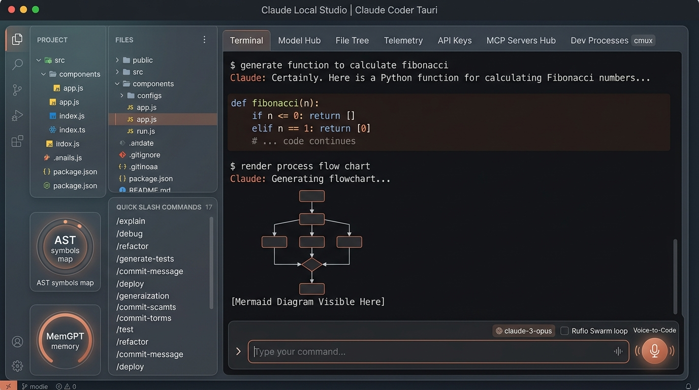

# 🦀 Claude Coder Desktop (Tauri v2 in Rust)

> **L'applicazione Desktop nativa ultra-leggera in Rust per lo sviluppo assistito da Intelligenza Artificiale, compatibile con Claude Code, Ollama, LM Studio, Apple MLX e tutti i principali provider cloud.**



---

## ⚡ Perché Tauri in Rust vs Electron?
* **Zero Spreco di RAM**: Occupa meno di **60 MB di RAM** (rispetto agli oltre 800 MB - 1.5 GB delle tipiche app Electron).
* **Avvio Istantaneo**: Tempo di avvio inferiore a **300 millisecondi**.
* **Integrazione Nativa con il Sistema Operativo**:
  * File picker nativo macOS (AppleScript), Windows (FolderBrowserDialog) e Linux (Zenity).
  * Apertura istantanea di file e cartelle in **Cursor**, **VS Code**, **Windsurf** o nel **Finder/File Explorer**.
  * Sicurezza sandbox nativa garantita da Rust.

---

## 🌟 Funzionalità Chiave

1. **Dashboard Completa Integrata**: Include Terminal Console, Model Hub con download 1-clic, File Explorer con Diff Viewer, Telemetry & Token Economics, e Gestione Chiavi API.
2. **Hub Server MCP Integrato**: Marketplace preconfigurato con 11+ server MCP (GitHub, Postgres, SQLite, Puppeteer, Brave Search, Notion, Linear, Slack, Docker, Figma, RuVector) ed export in 1 clic per Cursor e Claude CLI.
3. **Multi-Agente & Auto-Debug**: Esecuzione del loop multi-agente `/swarm`, diagrammi `/diagram`, specifiche `/prd` e auto-debug `/autofix`.
4. **Dettatura Vocale Hands-Free**: Voice-to-Code nativo per dettare istruzioni vocali direttamente nel prompt.
5. **Memoria Gerarchica (Letta/MemGPT)**: Ispezione e gestione visiva dei 3 livelli di memoria di progetto in `.claude/agentdb.json`.

---

## 🛠️ Compilazione & Esecuzione

### Prerequisiti
* **Rust**: `curl --proto '=https' --tlsv1.2 -sSf https://sh.rustup.rs | sh`
* **Node.js / Bun**: per la gestione degli asset UI.

### Avvio in Modalità Sviluppo
```bash
cd claude-coder-tauri
cargo tauri dev
```

### Build del Binario di Produzione (.dmg / .exe / .AppImage)
```bash
cargo tauri build
```

Il binario ottimizzato verrà generato in `src-tauri/target/release/bundle/`.

---

## 📄 Licenza
Rilasciato sotto licenza MIT.
